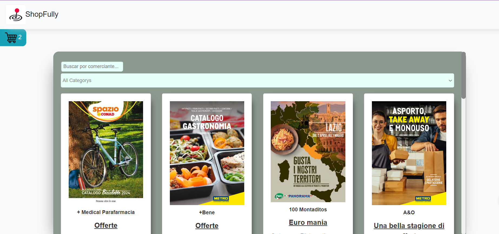
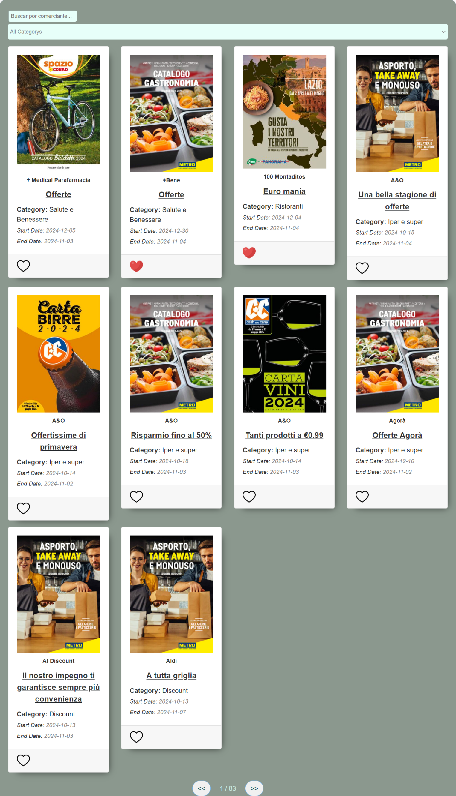

# ShopFully
RShopFully empowers you to discover exciting offers and discounts, transforming your shopping experience. It seamlessly integrates data from a CSV file into a user-friendly Angular front-end, powered by a robust Node.js back-end for potential future data management needs.

## Key Features:

- **CSV Data Import:** Import offers and discounts from a CSV file for effortless data management.
- **Intuitive Interface:** A well-designed front-end component showcases the imported data in a clear and user-friendly manner.
- **User-Friendly Navigation (Optional):** Implement filtering and search functionality for refined user experiences (based on your implementation).
- **Node.js Back-end (Optional):** The back-end facilitates data communication and lays the foundation for potential server-side features (consider implementing when needed).

## Install and Use

## Front-end 
1. Clone the repository:
   git clone https://github.com/MarinaDevops4/ShopFully.git
2. Navigate to the frontend directory: 
   cd shopfully/frontend
3. Install dependencies:
   npm install
4.Start the application:
   ng serve
5. The frontend should now be runnig at http://localhost:4200/

## Back-end 
**1.Clone the repository:** 
   git clone https://github.com/MarinaDevops4/ShopFully.git
**2.Navigate to the frontend directory:** 
   cd shopfully/server
**3.Install dependencies:**
   npm install
**4.Start the application:**
   nodemon app.js
**5. The frontend should now be runnig at http://localhost:3000/**

## Usage
Once both the backend and frontend servers are running, you can access the application in your browser. The frontend will communicate with the backend API to fetch offers and discounts from the CSV file and display them to the user in an Angular component.

